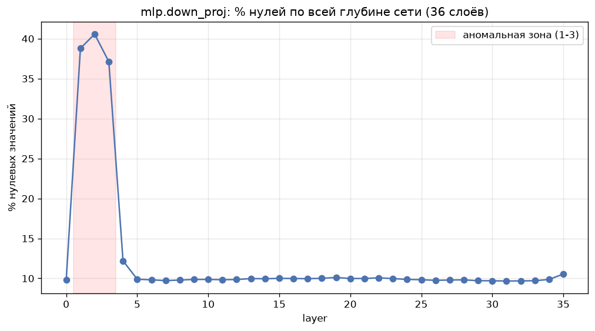
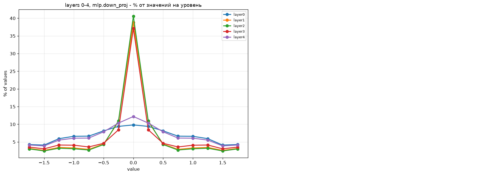

# hif4-compression

Extra lossy compression on top of weights already quantized to HiFloat4
(S1P2 format, 4 bits/value) for Qwen3 models (8B / 32B / 30A3B).

Metrics tracked: compression ratio (`|X| / |f(X)|`), MSE, Hamming distance,
and wall-clock time (compress + decompress under 60s total).

## Layout

```
hif4_compression/
├── data/s1p2/            # .bin weight files go here (gitignored, see below)
├── src/
│   ├── s1p2_io.py         # S1P2 decode/unpack
│   ├── eda.py             # stats over files, anomaly detection
│   ├── compression.py     # sparsification + huffman
│   ├── metrics.py         # compression ratio / MSE / hamming
│   └── visualize.py       # histograms, heatmaps, comparison plots
├── scripts/
│   ├── explore_data.py            # EDA over data/s1p2
│   └── run_compression_poc.py     # run the compression pipeline on one file
├── tests/
└── outputs/               # figures, csv/json results
```

## Setup

```bash
python3 -m venv venv
source venv/bin/activate
pip install -r requirements.txt
```

## Usage

Drop weight files into `data/s1p2/`:

```
data/s1p2/model.layers.0.self_attn.q_proj.weight_attn_q_proj_S1P2.bin
data/s1p2/model.layers.0.mlp.down_proj.weight_mlp_down_proj_S1P2.bin
...
```

Run EDA (on a representative sample by default - one file per projection
type across early/mid/late layers; pass `--all` to scan every file):

```bash
python scripts/explore_data.py
python scripts/explore_data.py --all
```

Run the compression pipeline on one file:

```bash
python scripts/run_compression_poc.py data/s1p2/<filename>.bin
```

Prints compression ratio, MSE, Hamming distance, and timing at a few
sparsity levels.

Tests:

```bash
python -m pytest tests/
```

## S1P2 format

4 bits per value: 1 sign bit, 1 integer bit, 2 fraction bits.
Range is [-1.75, 1.75] in steps of 0.25.

## Baseline

```
lossless:  1.04x
lossy:     1.1x, ~10% quality drop
target:    ~1.25x without meaningfully hurting quality
```

Current sparsification + Huffman baseline hits 1.27x at 40% sparsity on
real weight files - above target, pending a quality check on the full
model before calling it done.

## Findings

`mlp.down_proj` on layers 1-3 sits at ~38-40% zero values, vs ~10% on
every other layer in the network (checked across all 36 layers):



The distribution itself is a sharp spike at exactly 0, not a gradual
shift - layers 1-3 overlap almost exactly with each other and diverge
sharply from typical layers:


